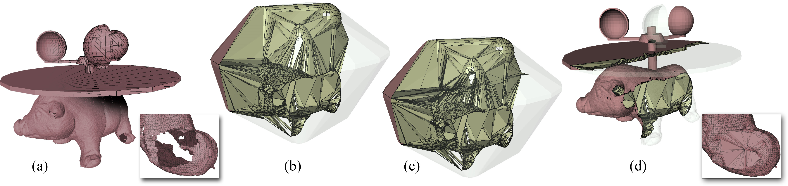

# Convex Polyhedral Meshing for Robust Solid Modeling

This code implements our volume meshing algorithm described in "**Convex Polyhedral Meshing for Robust Solid Modeling**" by Lorenzo Diazzi and Marco Attene (ACM Trans Graphics Vol 40, N. 6, Procs of SIGGRAPH Asia 2021). 
Please refer to our paper for details. You may download a copy here: http://arxiv.org/abs/2109.14434

<p align="center"></p>

## Usage
Clone this repository, including submodules, with:
```
git clone --recursive https://github.com/MarcoAttene/VolumeMesher
```
On Windows MSVC you may run ```GRSI_script.bat``` to automatically configure, compile and run the executable on two example models.
On other systems you may build the executable as follows:
```
mkdir build
cd build
cmake ..
```
This will produce an appropriate building configuration for your system.
On Windows MSVC, this will produce a mesh_generator.sln file.
On Linux/MacOS, this will produce a Makefile. 
Use it as usual to compile mesh_generator.

When compiled, the code generates an executable called ``mesh_generator``.
Launch it with no command line parameters to have a list of supported options.

Examples:

```
mesh_generator model.off
```
creates a file called ``volume.msh`` representing the volume mesh enclosed by the input.

```
mesh_generator -v model.off
```
same as above, but the ``-v`` option makes the tool print useful information during the process.

```
mesh_generator -v -t model.off
```
same as above, but ``-t`` makes the tool tetrahedrize all the cells before saving.

```
mesh_generator -s model.off
```
creates a file called ``skin.off`` representing the surface that bounds the volume mesh. ``skin.off`` is a mesh of convex polygons.

```
mesh_generator -s -t model.off
```
same as above, but ``-t`` makes the tool triangulate all the facets before saving.

```
mesh_generator -b model.off
```
creates a file called ``black_faces.off`` representing the input model with intersections resolved.


We tested our code on MacOS (GCC-10) and Windows (MSVC 2019).
It should work on Linux-GCC and MacOS-Clang too, but we have not tested it on these configurations.

|:warning: WARNING: Apparently, CLANG does not support a fully IEEE compliant floating point environment which is necessary to guarantee that indirect predicates work as expected. The only way we found to guarantee correctness on this compiler was to disable all optimizations. Please be aware of this fact should you notice a performance degradation in your experiments. |
| --- |

## Citing us
If you use our code in your academic projects, please cite our paper using the following BibTeX entry:
```
@article{volmesh2021,
  title   = {Convex Polyhedral Meshing for Robust Solid Modeling},
  author  = {Diazzi, Lorenzo and Attene, Marco},
  journal = {ACM Transactions on Graphics (SIGGRAPH Asia 2021)},
  year    = {2021},
  volume  = {40},
  number  = {6}
}
```

## Copyright

VolumeMesher is Copyright(C) 2021: IMATI-GE / CNR                                       

All rights reserved.                                                      
                                                                  
This program is free software; you can redistribute it and/or modify      
it under the terms of the GNU General Public License as published by      
the Free Software Foundation; either version 3 of the License, or         
(at your option) any later version.                                       
                                                                          
This program is distributed in the hope that it will be useful,           
but WITHOUT ANY WARRANTY; without even the implied warranty of            
MERCHANTABILITY or FITNESS FOR A PARTICULAR PURPOSE.  See the             
GNU General Public License (http://www.gnu.org/licenses/gpl.txt)          
for more details.                                                         
